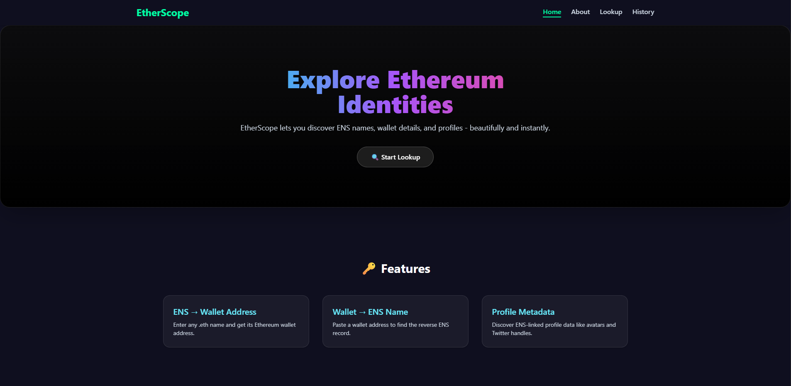
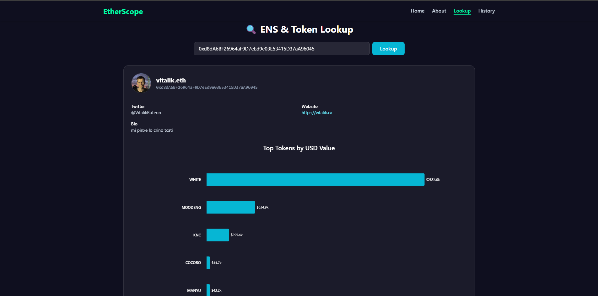

# 🔍 EtherScope

EtherScope is a modern Ethereum address and ENS name lookup tool built with React. It allows users to search Ethereum wallet addresses or ENS names and retrieve detailed profile information and token analytics in a visually rich and interactive way.

---

## ✨ Features

* 🔎 ENS name and wallet address lookup using ethers.js
* 🧠 Automatic ENS resolution, avatar, name, bio, website, and Twitter if available
* 📊 Token analytics using Covalent API displayed as interactive charts
* 📜 Persistent lookup history saved in localStorage
* 🗑️ Ability to delete individual history entries or clear all
* 🎨 Modern, responsive UI with animations using framer motion

---

## ⚙️ Tech Stack

* React + Vite
* Tailwind CSS
* ethers.js (for ENS resolution)
* Covalent API (for token balances)
* recharts (via recharts)
* Framer Motion (animations)
* lucide-react (icons)

---

## 🚀 Getting Started

### 1. Clone the repo

```bash
git clone https://github.com/Dev-Rodiyat/EtherScope.git
cd EtherScope
```

### 2. Install dependencies

```bash
npm install
```

Then add:

```
VITE_COVALENT_API_KEY=your_covalent_api_key_here
VITE_ALCHEMY_API_KEY=your_alchemy_api_key_here
```

You can get a free Covalent API key from: [Covalent API](https://goldrush.dev/platform/)
You can get a free Alchemy API key from: [Alchemy API/](https://dashboard.alchemy.com/)

### 4. Start development server

```bash
npm run dev
```

The app will be available at [http://localhost:5173](http://localhost:5173)

---

## 🖼️ Screenshots

| Home page                            | Lookup page                          |
| ------------------------------------ | -------------------------------------|
|  |  |

---

## 🛠️ Project Structure

```
/src
  /components
    - Lookup.jsx
    - History.jsx
    - TokenChart.jsx
  /utils
    - ensUtils.js
    - covalentUtils.js
  App.jsx
  main.jsx
.env
```

---

## 🧠 Future Improvements

* Support for multiple chains (Polygon, BSC, etc.)
* ENS avatar fallback logic with Blockies
* Integration with other APIs like Moralis or Alchemy
* Wallet connect for personal insights

---

## 🙌 Acknowledgements

* Covalent HQ – Unified blockchain data
* ENS Domains – Human-readable Ethereum names
* Ethers.js – Ethereum library for the modern web
* Chart.js – Data visualization
